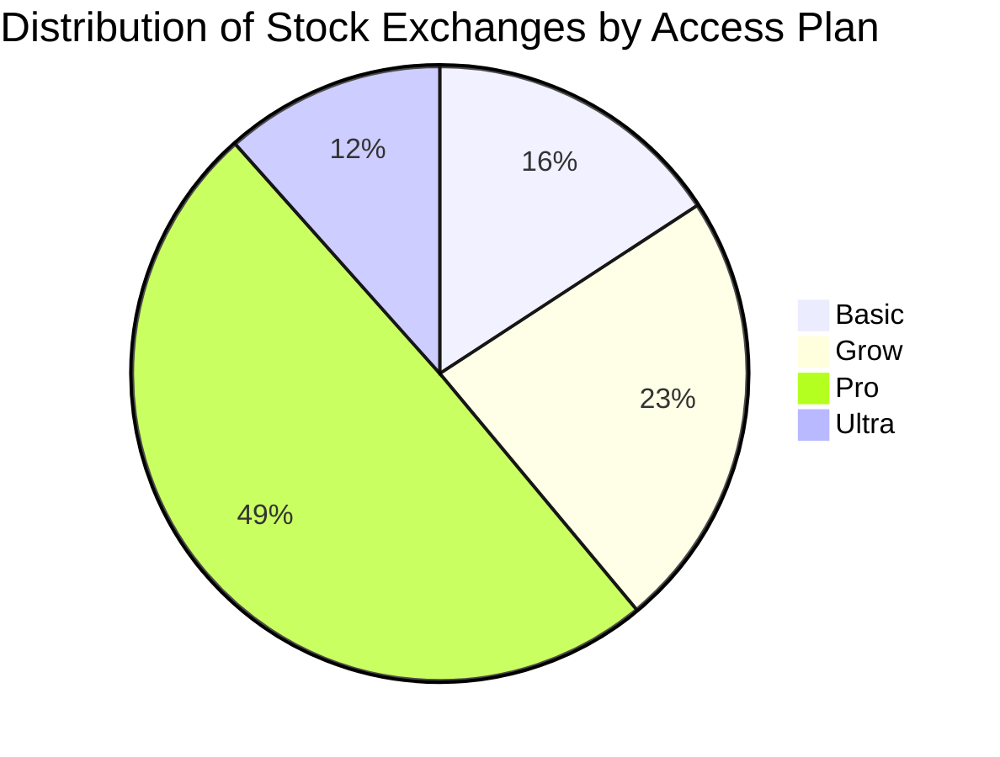

(update 21/03/2025)

Here's the classification of all stock exchanges by their required access plan:

## Basic Plan (15 exchanges)

- OTC Pink Marketplace (PINX)
- Expert Market (EXPM)
- NYSE Mkt LLC (XASE)
- OTC Grey Market (PSGM)
- NYSE Arca (ARCX)
- NASDAQ (XNAS)
- Investors Exchange (IEXG)
- NASDAQ/NGS (Global Select Market) (XNGS)
- OTCQX Marketplace (OTCQ)
- New York Stock Exchange, Inc. (XNYS)
- NASDAQ/NMS (Global Market) (XNMS)
- CBOE BZX U.S. Equities Exchange (BATS)
- NASDAQ Capital Market (XNCM)
- ICE Futures US (NYBOT)
- OTCQB Marketplace (OTCB)

## Grow Plan (22 exchanges)

- Euronext - Euronext Brussels (XBRU)
- Brazil Stock Exchange (Bovespa) (BVMF)
- TSX Venture Exchange (TSXV)
- Canadian National Stock Exchange (CSE)
- Toronto Stock Exchange (TSX)
- NEO Exchange - NEO-L (NEOE)
- Indian National Stock Exchange (NSE)
- Bombay Stock Exchange (BSE)
- Euronext Dublin (XDUB)
- Euronext - Euronext Paris (XPAR)
- Munich Stock Exchange (XMUN)
- Börse Berlin Stock Exchange (XBER)
- Deutsche Börse Xetra (XETR)
- Stuttgart Stock Exchange (XSTU)
- Hamburg Stock Exchange (XHAM)
- Hannover Stock Exchange (XHAN)
- Frankfurt Stock Exchange (FSX)
- Düsseldorf Stock Exchange (XDUS)
- Euronext - Euronext Amsterdam (XAMS)
- Euronext - Euronext Lisbon (XLIS)
- Istanbul Stock Exchange (BIST)
- London Stock Exchange (LSE and AIMX)
- OTC Link ATS - OTC Markets (OTCM)

## Pro Plan (47 exchanges)

- Argentinian Stock Exchange (BCBA)
- Australia Stock Exchange (ASX)
- CHI-X Market Australia (CXA)
- Vienna Stock Exchange (VSE)
- Santiago Stock Exchange (BVS)
- Shenzhen Stock Exchange (SZSE)
- Shanghai Stock Exchange (SSE)
- Prague Stock Exchange (PSE)
- Copenhagen Stock Exchange (OMXC)
- Egyptian Exchange (EGX)
- NASDAQ Tallinn As (OMXT)
- Helsinki Stock Exchange (OMXH)
- Athens Stock Exchange (ASE)
- Hong Kong Stock Exchange (HKEX)
- Budapest Stock Exchange (BSE)
- Euronext Dublin (XMSM and XESM)
- Tel-Aviv Stock Exchange (TASE)
- Italian Stock Exchange (MTA)
- Sapporo Securities Exchange (XSAP)
- Tokyo Stock Exchange (JPX)
- NASDAQ Riga AS (OMXR)
- Nasdaq Vilnius Stock Exchange (OMXV)
- Malaysia Stock Exchange (MYX)
- Mexican Stock Exchange (BMV)
- New Zealand Stock Exchange (NZX)
- Oslo Stock Exchange (OSE)
- Pakistan Stock Exchange (PSX)
- Lima Stock Exchange (BVL)
- Qatar Stock Exchange (QE)
- Moscow Exchange (MOEX)
- Saudi Stock Exchange (Tadawul)
- Singapore Exchange (SGX)
- Johannesburg Stock Exchange (JSE)
- Korea Exchange (KONEX, KRX, KOSDAQ)
- Madrid Stock Exchange (BME)
- First North Sweden (SSME)
- Spotlight Stock Market (XSAT)
- Stockholm Stock Exchange (OMX)
- Swiss Stock Exchange (SIX)
- Taiwan Stock Exchange (TWSE)
- Taipei Exchange (TPEX)
- Stock Exchange of Thailand (SET)
- Abu Dhabi Securities Exchange (ADX)
- Caracas Stock Exchange (BVCC)
- Indonesia Stock Exchange (IDX)

## Ultra Plan (11 exchanges)

- Botswana Stock Exchange (BSE)
- Colombia Stock Exchange (BVC)
- Iceland Stock Exchange (ICEX)
- Jamaica Stock Exchange (JSE)
- Kuwait Stock Exchange (XKUW)
- Philippine Stock Exchange (PSE)
- Warsaw Stock Exchange (GPW)
- Bucharest Stock Exchange (BVB)
- Dubai Financial Market (DFM)

The majority of stock exchanges require a Pro plan (47 exchanges), followed by the Grow plan (22 exchanges), Basic plan (15 exchanges), and Ultra plan (11 exchanges). As shown in the pie chart, this means approximately 49% of the exchanges require a Pro plan, 23% require a Grow plan, 16% require a Basic plan, and 12% require an Ultra plan.
